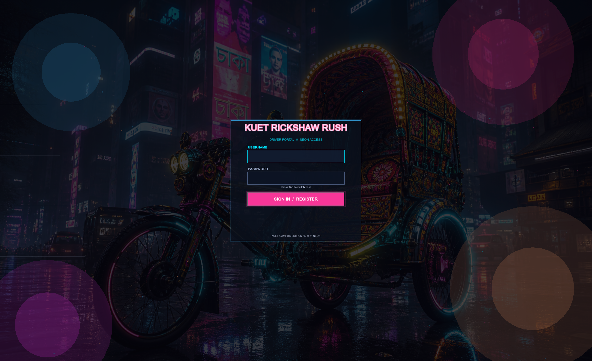
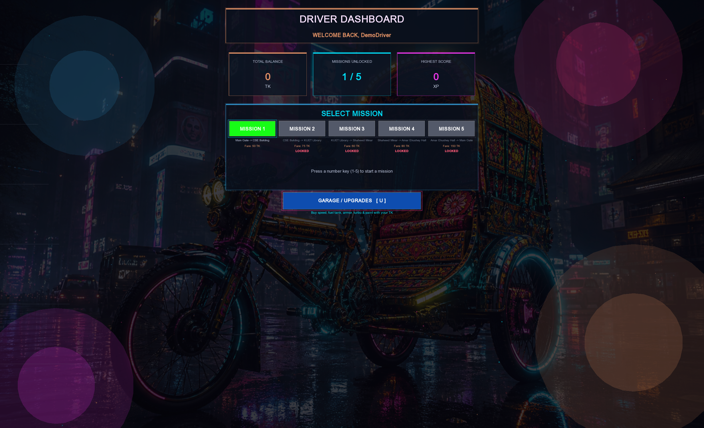
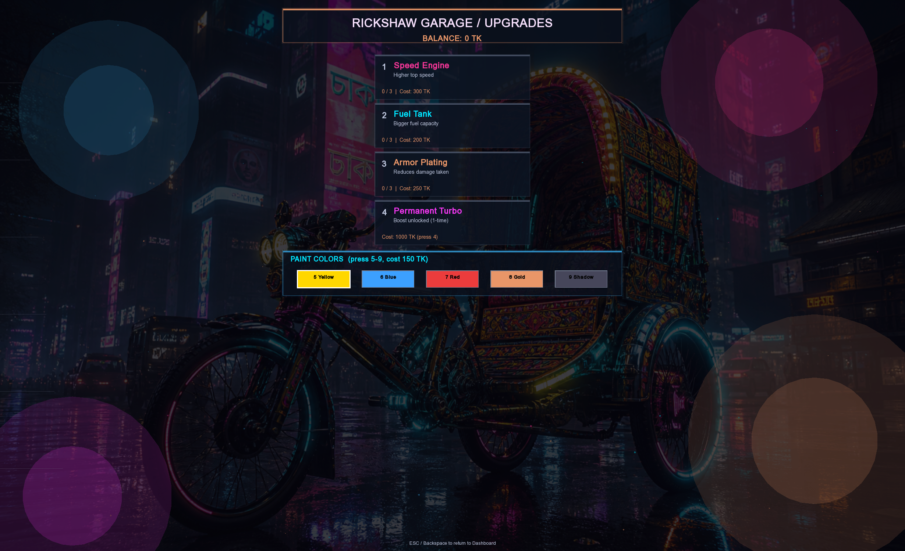
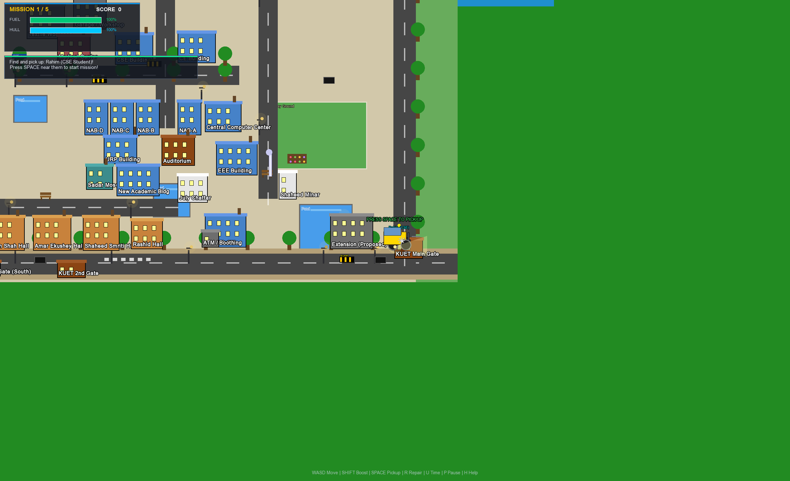

# KUET Rickshaw Rush

**A procedurally-rendered, mission-based rickshaw driving game set on the real campus map of Khulna University of Engineering & Technology (KUET) — built entirely in C++ (with a focus on core Object Oriented Programming) using SFML.**

No sprite sheets. No external art assets. Every rickshaw, building, tree, and lamp post is drawn with raw SFML shapes.

<p align="center">
  
  
  
  
 
  
</p>




---

## Table of Contents

- [About](#about)
- [Screenshots](#screenshots)
- [Features](#features)
- [Tech Stack](#tech-stack)
- [The World Map (2000 x 1500)](#the-world-map-2000--1500)
- [The Rickshaw](#the-rickshaw)
- [Passengers & Pickup](#passengers--pickup)
- [Mission System](#mission-system)
- [Account System](#account-system)
- [Sound](#sound)
- [HUD & UI](#hud--ui)
- [Screenshots (In-Game Capture)](#screenshots-in-game-capture)
- [Installation](#installation)
- [Usage](#usage)
- [Controls](#controls)
- [Project Structure](#project-structure)
- [Contributing](#contributing)
- [License](#license)
- [Acknowledgments](#acknowledgments)

---

## About

**KUET Rickshaw Rush** drops you behind the handlebars of a rickshaw on a full, hand-mapped recreation of the KUET campus. Pick up passengers, race against fuel and time limits, dodge collisions, upgrade your ride at the garage, and build your own custom fare runs on a mini-map editor — all rendered with 100% procedural SFML graphics and a neon-styled UI.

---

## Screenshots

| Screen | Preview |
|---|---|
| **Driver Portal (Login / Register)** |  |
| **Driver Dashboard** |  |
| **Garage / Upgrades** |  |
| **Mission 1 — Campus Map** |  |
| **On the road** |  |

> Tip: you can press **F12** in-game anytime to save your own screenshots as PNGs right into the game folder.

---

## Features

- Full 2000x1500 campus map with 11 drivable road segments and soft road-snapping
- 45 individually categorized buildings (academic, halls, gates, mosque, service, monuments)
- Detailed procedural rickshaw — animated pedals, spinning 4-spoke wheels, suspension bob, glowing headlight
- 5 story missions plus a fully custom mission builder with a mini-map picker
- Day/night cycle
- Realistic collisions, with gates, plazas, and the library kept intentionally passable
- Persistent garage upgrades (speed, fuel, armor, turbo, paint)
- Synthesized engine/wind audio plus streaming background music
- Minimap plus off-screen compass arrow with live distance to your destination
- Persistent accounts with saved progress, upgrades, and high scores
- Neon-themed menus, pause/help panels, and mission-complete overlays
- One-key (F12) in-game screenshot capture
- Robust cleanup and state handling across every screen transition

---

## Tech Stack

| Layer | Technology |
|---|---|
| Language | **C++17** |
| Graphics / Window / Audio | **SFML 3.0.2** (graphics, window, system, audio modules) |
| Toolchain | **MSYS2 / UCRT64**, GCC |
| Rendering | 100% procedural SFML shapes -- no external sprite sheets |
| Audio | Synthesized engine/wind SFX plus streaming MP3 for music |
| Persistence | Plain-text / binary save files (`users.txt`, `highscore.txt`) |

> **Note on SFML 3.0.2 API quirks handled in this codebase:**
> - `sf::Texture::create()` / `sf::Image::create()` don't exist in 3.0; size constructors, `loadFromImage`, and `texture.update(window)` are used instead for screenshots.
> - `setRotation` takes an `sf::Angle`; the project uses `sf::radians(angle)` throughout.
> - `sf::FloatRect` uses `.position` / `.size` members (not `.left/.top/.width/.height`).
> - `sf::Text` requires the `sf::Text(font, string, size)` constructor signature.

---

## The World Map (2000 x 1500)

### Coordinate & window system

- **World size:** `WORLD_WIDTH = 2000`, `WORLD_HEIGHT = 1500` (floats)
- **Window:** desktop resolution minus 100px on each side (e.g. a 2560x1600 desktop opens a 2460x1500 window)
- **Camera:** follows the player with `camera.setCenter(playerX, playerY)`

### Road network -- 11 segments

| Seg | Type | Coordinates | Notes |
|---|---|---|---|
| 1 | Horizontal | `0, 1400` — W=2000 H=80 | Bottom main road |
| 2 | Horizontal | `400, 50` — W=1380 H=65 | Top road |
| 3 | Vertical | `1800, 50` — W=70 H=1400 | Right road |
| 4 | Vertical | `385, 0` — W=65 H=1500 | Left road |
| 5 | Horizontal | `620, 825` — W=700 H=60 | Central horizontal |
| 6 | Vertical | `1060, 340` — W=60 H=680 | Central vertical |
| 7 | Horizontal | `385, 560` — W=300 H=55 | Left horizontal |
| 8 | Horizontal | `450, 1240` — W=680 H=55 | Hall road |
| 9 | Vertical | `1380, 340` — W=60 H=900 | Right-mid vertical (reaches connector) |
| 10 | Horizontal | `390, 380` — W=720 H=55 | Upper-mid horizontal |
| 11 | Horizontal | `1060, 285` — W=400 H=60 | North connector (Library / north campus) |

**Road-snapping algorithm** (`nearestRoadCenter`): for each segment, a vertical road snaps the player's X to the road's center line (Y clamped between the road's top and bottom); a horizontal road snaps Y to the center line (X clamped between left and right). `applyRoadSnap` finds the closest center-line within a 60px radius and pulls the player toward it at 0.10 strength while moving — a soft correction that feels natural without locking you to rails.

### 45 buildings, categorized by theme

| Category | Color |
|---|---|
| Academic | Blue |
| Hall | Orange |
| Gate | Brown |
| Utility | Gray |
| Service | Red |
| Female hall | Pink |
| Mosque | Teal |
| Monuments | White |

- **Left extension:** Sub-Station, Water Tower, Institute, 2 female halls, 2 male halls, Foreign Dormitory, TT&C, Staff Bungalow
- **North:** Staff Tower, KUET Library, KUET School, Guest/VIP House
- **ME & Rokeya:** ME Building, Rokeya Hall, VP Staff Residence, Textile Workshop, Garage/Workshop
- **Central:** Medical Center, CSE, CE, EEE, NAB-A/B/C/D, Central Computer Center, URP, Auditorium
- **Student welfare:** Sadar Mosque, New Academic Building, July Chattar, Shaheed Minar, SWC, ATM, Extension
- **Halls:** Lalon Shah, Amar Ekushey, Shaheed Smriti, Rashid
- **Gates:** Main, 2nd, Pocket (South), Pocket (North)

**Collision rule:** any building whose name contains `Gate`, `Library`, `Minar`, `Chattar`, or `Square` is passable (skipped in the collision loop), so you can drive straight through gates, plazas, and the library area.

### Terrain & decor

- 3 grass zones (left band, top band, right band)
- 5 ponds/lakes (`Lake`, `Pond`) with blue fill, shimmer effect, and labels
- 2 gardens (Mango, Litchi) via `drawGarden`
- 3 play-fields via `drawPlayField`
- ~54 trees, 24 lamps, benches, 6 flower beds
- 4 directional signs ("HALLS ->", "CSE ->", "LIBRARY ->")

---

## The Rickshaw

Implemented in `src/Rickshaw.cpp` / `include/Rickshaw.h`.

### Visual detail (all procedural)

- Animated pedals that move with speed
- 4-spoke wheels that spin with speed, plus suspension bob
- Roof canopy and a directional headlight that glows at night
- Smooth facing rotation via `sf::radians`

### Movement model

- Acceleration/braking, with an `LShift` boost that trades faster speed for higher fuel burn
- Position updates constrained by `getBounds()`

### Stats & upgrades

Applied per mission from `UserProfile`:

| Stat | Effect |
|---|---|
| `setSpeedMult` | `1.0 + speedUpgrade x 0.15` — up to **1.45x** |
| `setMaxFuel` | `100 + fuelUpgrade x 50` — up to **250** |
| `setArmorMult` | `1.0 - armorUpgrade x 0.20` — down to **0.40x** damage taken |
| Turbo | Permanently unlocked from Mission 4 onward |
| Paint | 5 color schemes via `applyPaint` |

### Damage & callbacks

- `takeDamage(dmg)` applies the current armor multiplier
- `setDamageCallback` / `setBoostCallback` feed mission requirement tracking (e.g. no-damage or no-boost run conditions)

---

## Passengers & Pickup

Implemented in `src/Passenger.cpp` / `include/Passenger.h`.

- 5 story passengers spawn at fixed points, each tagged with `setMissionId`
- Visuals: idle bobbing, waving arms, swinging legs, a golden beacon, and a "PRESS SPACE" hint
- Pickup logic: `Passenger::update(player)` checks distance to the player; within a **90px** radius, `isNear()` returns true and pressing **Space** picks them up (`setPassengerPicked` on the active mission)
- `reset()` restores a passenger for retry or a return to the dashboard

---

## Mission System

Implemented in `include/Missions.h`.

### Base class: `PassengerMission : IMission`

Holds: passenger/destination name, `targetX/Y`, `fareReward`, pickup/drop/completion flags, a player reference, starting fuel, damage taken, boost-used flag, and a completion timer.

**Lifecycle:**

1. `Start(player)` — resets all state, sets `missionStatus = 1`, shows the "Find and pick up..." dialogue
2. **Pickup** — `setPassengerPicked()` starts the mission timer and updates the dialogue
3. `Update(dt, player)` — once picked up (and not yet dropped), tracks distance to the target; within **100px**, calls `checkRequirements()`, and if all pass, drops the passenger and sets `missionCompleted = true`
4. `checkRequirements()` evaluates the mission's `RequirementType`:
   - `TIME_ONLY` — always passes
   - `NO_DAMAGE` — fails (status 3) if `damageTaken > 0`
   - `FUEL_LIMIT` — fails if remaining fuel is below the threshold
   - `NO_BOOST` — fails if boost was used
5. On success, status moves to **2** after a 3-second completion message

A failed strict requirement (status 3) triggers `isGameOver` in the main loop.

### The 5 story missions

| # | Rider | Route | Fare | Time | Bonus Rules |
|---|---|---|---|---|---|
| 1 | Rahim (CSE Student) | Main Gate -> CSE Building | 50 TK | 60 s | -- |
| 2 | Sultana (Library) | CSE -> KUET Library | 75 TK | 50 s | No Damage |
| 3 | Shahid (Student) | Library -> Shaheed Minar | 60 TK | 55 s | Fuel > 50% |
| 4 | Liton (Hall Student) | Shaheed Minar -> Amar Ekushey Hall | 80 TK | 40 s | No Boost |
| 5 | Gate Guard | Amar Ekushey Hall -> KUET Main Gate | 150 TK | 70 s | No Damage, Fuel > 40%, No Boost |

### Custom Mission Builder

`CustomMission` extends `PassengerMission`, adding `pickupX/pickupY` and `getPickupX/Y()`. Its constructor takes a pickup point, destination, fare, time limit, and passenger/destination names; the default requirement type is `TIME_ONLY`.

The in-game builder (`CustomMissionScreen`):

- Renders a scaled mini-map — buildings as colored rects, roads as gray bands, and a crosshair ring for the cursor
- **WASD / Arrow keys** move the crosshair in 15px steps, clamped to the 2000x1500 world
- **Space** sets the pickup point (auto-snapped to the nearest road), then the destination point
- **`-` / `+`** adjust the fare (20-1000 TK)
- **`[` / `]`** adjust the time limit (10-300s)
- **Enter** launches a `new PlayingScreen(pickupX, pickupY, destX, destY, fare, time)`, and the main loop spins up a fresh `CustomMission` + `Passenger`

---

## Account System

Implemented in `src/Auth.cpp`.

### Save format (`users.txt`)

```
username binaryPass earnings unlockedMission score speedUpgrade fuelUpgrade armorUpgrade turboUpgrade paintIndex
```

Passwords are stored as a binary string (`bitset<8>` per character). Progress is written via `AuthManager::saveProgress(extraEarnings, highestMissionCompleted, currentScore)` and `saveUpgrades()`.

### Screen flow (state machine)

| Screen | Purpose |
|---|---|
| `LoginScreen` | Username/password entry with cursor animation -> login or register |
| `DashboardScreen` | Mission cards `1-5` (unlocked up to `unlockedMission`), `U`/`G` for garage, `C` for custom mission, `Esc` to go back |
| `UpgradeScreen` | Bank balance + upgrade shop cards |
| `CustomMissionScreen` | The mini-map pickup/destination picker described above |
| `PlayingScreen` | Thin wrapper — actual in-game rendering happens in `main.cpp` via `dynamic_cast<PlayingScreen*>` |

---

## Sound

Implemented in `src/SoundManager.cpp`.

- Engine rumble and wind noise are synthesized, with volume tied to `speedFrac` and boost state
- One-shot SFX: `Click`, `Pickup`, `Damage`, `Turbo`, `Complete`
- Background music streams from `assets/bg music.mp3`
- Engine/wind audio auto-stops when paused, on game over, or when not actively driving

---

## HUD & UI

Rendered from `src/main.cpp`.

- **Top-left stats panel:** mission number, score, fuel bar, time bar, hull/armor bar, and a dialogue box
- **Top-right:** a polished minimap
- **Destination highlighter:** a pulsing gold diamond + "DROP POINT" label when the destination is on-screen; a gold compass arrow with N/S/E/W direction and live distance when it's off-screen
- **Panels:** pause (`P`/`Esc`), help (`H`), game-over, mission-complete, and back-to-dashboard (`B` resets state and returns)
- **Neon aesthetic** shared across screens via a common `UIPalette` and `drawNeonPanel` / `drawAnimatedNeonBackground` helpers

---

## Screenshots (In-Game Capture)

Press **F12** during play to save `kuet_rickshaw_shot_NN.png` to the game folder. Internally: `sf::Image(windowSize, Black)` -> `Texture::loadFromImage` -> `snap.update(window)` -> `copyToImage().saveToFile`.

---

## Installation

The project targets **Windows** via the **MSYS2 UCRT64** environment.

### Prerequisites

- [MSYS2](https://www.msys2.org/) installed and updated
- The UCRT64 toolchain and SFML 3.0.2 package

### 1. Install the toolchain and SFML

Open the **MSYS2 UCRT64** terminal and run:

```bash
pacman -Syu
pacman -S mingw-w64-ucrt-x86_64-gcc
pacman -S mingw-w64-ucrt-x86_64-sfml
```

### 2. Clone the repository

```bash
git clone https://github.com/<your-username>/kuet-rickshaw-rush.git
cd kuet-rickshaw-rush
```

### 3. Build

```bash
g++ -std=c++17 -Iinclude -IC:/msys64/ucrt64/include \
    src/main.cpp src/Auth.cpp src/Campus.cpp src/Passenger.cpp src/Rickshaw.cpp \
    src/Environment.cpp src/Constants.cpp src/SoundManager.cpp \
    -o game.exe -LC:/msys64/ucrt64/lib \
    -lsfml-graphics -lsfml-window -lsfml-system -lsfml-audio
```

> Adjust the source file list/paths above to match your actual folder layout (e.g. if you're using a `Makefile` or CMake, substitute the equivalent build command). Make sure the `assets/` folder (containing `bg music.mp3` and any fonts) sits alongside the built executable.

### 4. Run

```bash
./game.exe
```

On first launch, `users.txt` and `highscore.txt` are created automatically in the game folder.

---

## Usage

1. **Launch** the game and either **register** a new account or **log in**.
2. From the **Dashboard**, pick an unlocked **story mission (1-5)**, open the **Garage** (`U`/`G`) to spend earnings on upgrades, or build a **Custom Mission** (`C`).
3. Drive to the golden beacon, press **Space** near the passenger to pick them up, then race to the drop-point diamond (or follow the off-screen compass arrow) before time or fuel runs out.
4. Complete the mission's requirements (e.g. no damage, no boost, or a fuel ceiling) to bank the fare and unlock the next mission.
5. Press **F12** anytime to save a screenshot of your run.

### Example: building a custom fare run

1. From the Dashboard, press **C**.
2. Use **WASD**/arrows to move the crosshair over a spot on the mini-map, then press **Space** to set the pickup point (it snaps to the nearest road).
3. Move the crosshair again and press **Space** to set the destination.
4. Tune the fare with **`-`/`+`** and the time limit with **`[`/`]`**.
5. Press **Enter** to launch straight into the run.

---

## Controls

| Input | Action |
|---|---|
| `W A S D` / Arrow keys | Drive / move cursor (menus) |
| `LShift` | Boost (higher speed, faster fuel burn) |
| `Space` | Pick up passenger / confirm (menus) |
| `-` / `+` | Adjust fare (Custom Mission Builder) |
| `[` / `]` | Adjust time limit (Custom Mission Builder) |
| `Enter` | Confirm / launch mission |
| `U` / `G` | Open Garage (upgrades) |
| `C` | Open Custom Mission Builder |
| `P` / `Esc` | Pause |
| `H` | Help panel |
| `B` | Back to dashboard (resets run state) |
| `F12` | Save screenshot |

**Simplified dashboard reference:**
| Key | Action |
|---|---|
| `1` - `5` | Start story mission 1 - 5 |
| `U` / `G` | Open the Garage / Upgrades shop |
| `C` | Open the Custom Mission Builder |
| `Esc` | Back to login |

---

## Project Structure

```
kuet-rickshaw-rush/
├── src/
│   ├── main.cpp             # Game loop, world, HUD, compass, screenshots
│   ├── Auth.cpp             # Account system, screens, Custom Mission Builder
│   ├── Campus.cpp           # Shared campus map: buildings & road network
│   ├── Rickshaw.cpp         # Player vehicle: visuals, movement, stats
│   ├── Passenger.cpp        # Passenger spawning, pickup, animation
│   ├── Environment.cpp      # Grass, ponds, gardens, day/night
│   ├── Constants.cpp        # Global constants
│   └── SoundManager.cpp     # Synthesized SFX + music streaming
├── include/
│   ├── Auth.h               # Screen state machine & user profile
│   ├── Campus.h             # Campus geometry shared with the mission builder
│   ├── Missions.h           # PassengerMission, CustomMission, requirements
│   ├── Rickshaw.h           # Player vehicle header
│   ├── Passenger.h          # Passenger header
│   ├── Environment.h        # Environment + garden/playfield helpers
│   ├── Minimap.h            # Live minimap
│   ├── GameObject.h / Vehicle.h / Interfaces.h   # Base classes
│   ├── CustomExceptions.h   # Fuel/time exception handling
│   ├── SoundManager.h       # SFX enums + static API
│   └── Constants.h          # Game constants
├── assets/
│   ├── fonts/               # arial.ttf, seguiemj.ttf
│   ├── bg music.mp3         # streaming background music
│   ├── background.png       # neon background art
│   └── lv1.tmx
├── screenshots/             # README gallery images
├── users.txt                # Generated on first run (account data)
├── highscore.txt            # Generated on first run
└── README.md
```

---

## Contributing

Contributions are welcome — whether it's a new mission, a map extension, a bug fix, or performance improvements to the procedural rendering.

1. **Fork** the repository and create a feature branch:
   ```bash
   git checkout -b feature/your-feature-name
   ```
2. **Follow the existing style:**
   - Keep all visuals procedural (SFML shapes) — no external sprite sheets or textures
   - Watch out for the SFML 3.0.2 API differences noted in [Tech Stack](#tech-stack)
   - Match the existing naming conventions in `Rickshaw`, `Passenger`, and `Missions`
3. **Test your changes** by building locally with the steps in [Installation](#installation) and running through at least one full mission.
4. **Commit** with a clear message:
   ```bash
   git commit -m "Add: brief description of your change"
   ```
5. **Push and open a Pull Request** against `main`, describing:
   - What changed and why
   - Any new controls, files, or dependencies introduced
   - Screenshots (F12 works great for this!) if the change is visual

### Reporting bugs / suggesting features

Please open an issue with:

- Your OS and MSYS2/SFML version
- Steps to reproduce (for bugs) or a clear description of the proposed feature
- Screenshots or logs where relevant

---

## License

This project is licensed under the **MIT License** — see the [LICENSE](LICENSE) file for details. *(Add a `LICENSE` file if you plan to release it.)*

---

## Acknowledgments

- Built for and inspired by the **Khulna University of Engineering & Technology (KUET)** campus
- Powered by the excellent [SFML](https://www.sfml-dev.org/) library
- Thanks to everyone who play-tested missions and reported bugs

---

<p align="center">Made with a lot of repair rides and cups of cha by the KUET Rickshaw Rush team.</p>
